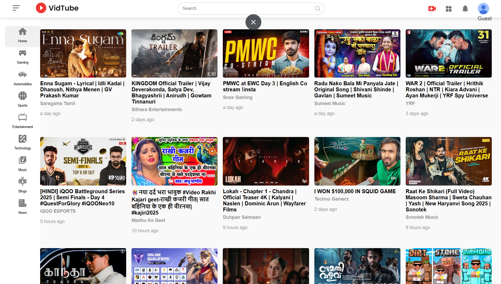
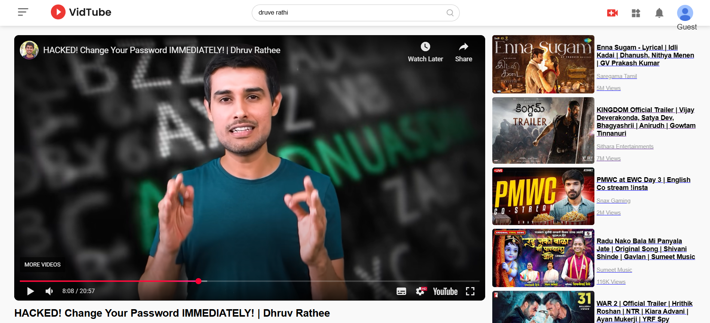
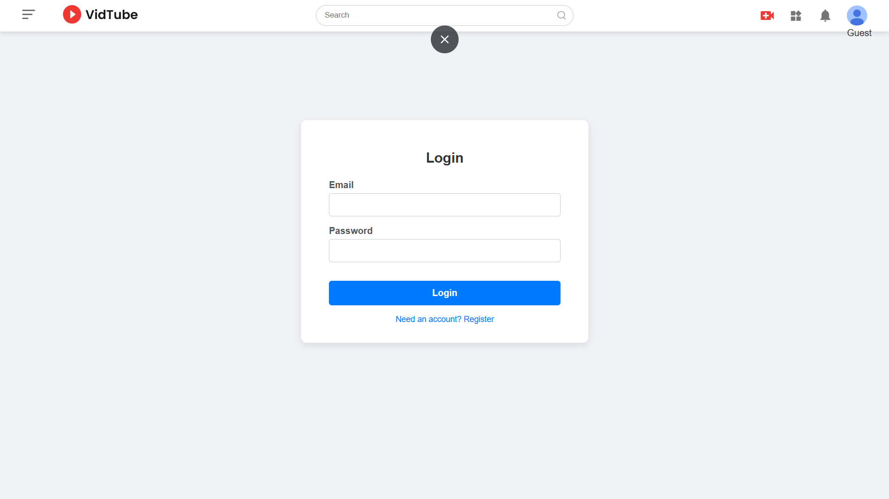

# VidTube

This project is a full-stack **MERN (MongoDB, Express.js, React, Node.js)** implementation of a YouTube-like application. Originally a front-end clone, it has been expanded to include a robust backend that supports user authentication and a dynamic video search API.

## Table of Contents

- [Features](#features)
- [Tech Stack](#tech-stack)
- [Usage](#usage)
- [Preview](#preview)
- [Deployment](#deployment)
- [Contact](#contact)
- [Acknowledgments](#acknowledgments)

## Features

- **Full-Stack MERN Architecture**: Built with a robust backend using Node.js and Express.js to handle data, API requests, and user logic.
- **User Authentication**: Secure user registration and login functionality to manage user sessions.
- **Dynamic Search Functionality**: Search for videos on any topic using the integrated backend API.
- **Video Playback**: Stream videos with controls for play, pause, and seek.
- **Responsive Design**: Optimized for various screen sizes and devices.
- **Interactive UI**: Includes animations and dynamic elements for a better user experience.

## Tech Stack

- **Frontend**: React, React Router, Context API, CSS
- **Backend**: Node.js, Express.js, MongoDB
- **Database ODM**: Mongoose
- **Authentication**: JSON Web Tokens (JWT), bcryptjs

## Usage

- **Home Page**: Browse video thumbnails and interact with the video player.
- **Video Page**: Watch videos, view details, and interact with video controls.
- **Search**: Enter any topic in the search bar at the top to get relevant video results.
- **Authentication**: Click on the user icon to navigate to the login/registration page.

## Preview

### Home Page

*The home page displays video thumbnails and provides access to video playback.*

### Video Play Page with search results

*The video play with search results, page includes video playback controls and video details.*

### Login Section

*login page*

## Deployment

The project is deployed as a full-stack application with separate services for the frontend and backend.

-   **Frontend**: Deployed on Vercel at `[Your-Frontend-Vercel-Link]`
-   **Backend**: Deployed on Vercel at `[Your-Backend-Vercel-Link]`

## Contact

-   **Email** - [bhogerohan12@gmail.com](mailto:bhogerohan12@gmail.com)
-   **GitHub**: [https://github.com/RohanBhoge](https://github.com/RohanBhoge)
-   **Linkedin**:[https://www.linkedin.com/in/rohanbhoge](https://www.linkedin.com/in/rohanbhoge)

## Acknowledgments

-   Thanks to the React and Node.js communities for the excellent documentation and support.
-   Inspiration from various open-source projects and YouTube's UI/UX design.
